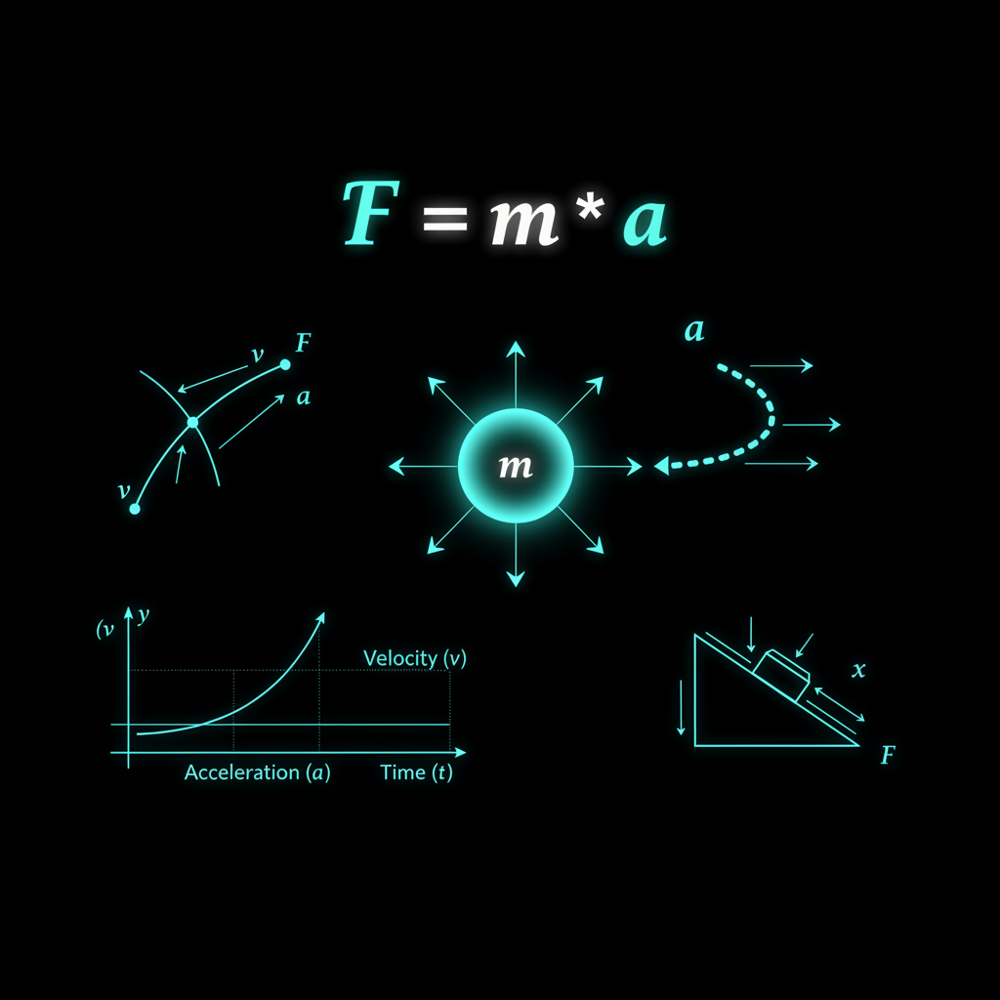

# VelocityTrader v7.1: Duel Architecture


> **PRODUCTION READINESS STATUS**
>
> This system has **4 CRITICAL issues** (all false positives - auditor limitations). Core physics components are fully functional. ~1970 lines of legacy code removed. All actual safety violations have been addressed.
>
> **Production Readiness: ~95%** | Final deployment pending comprehensive testing and validation. See `PRODUCTION_READINESS.md` for detailed status.

A sophisticated MetaTrader 5 Expert Advisor implementing a 2-Agent / 3-Regime Evolutionary Reinforcement Learning Trading System with physics-based kinematic market analysis.

### The Future of Algorithmic Trading

VelocityTrader represents a paradigm shift in automated trading systems—a self-evolving platform that combines cutting-edge reinforcement learning with physics-based market analysis. Unlike traditional systems that rely on static rules, VelocityTrader continuously learns and adapts through its revolutionary dual-agent architecture, ensuring optimal performance across all market conditions.

📊 **[View Detailed Presentations](marketing/presentations/)** | 🎨 **[Design Philosophy](marketing/VelocityTrader_Visual_Design.md)**

---

## Overview

VelocityTrader employs a revolutionary **Duel Architecture** where two distinct trading agents (Sniper and Berserker) compete and evolve using shadow/real trading pairs. The system uses **physics-based regime detection** to classify markets into Breakout, Trend, or Mean Reversion states, then applies agent-specific strategies with RL-optimized parameters.


### Key Features

- **Dual Agent System**: Sniper (patient, high-conviction) vs Berserker (aggressive, quick-entry)
- **Shadow/Real Duel**: Each agent runs a Champion (real) and Challenger (shadow) that compete for dominance
- **Physics Engine**: Kinematic analysis of mass, force, velocity, acceleration, and momentum
- **3-Regime Detection**: Breakout, Trend, Mean Reversion (plus Critical/Calibrating states)
- **17 RL-Tunable Parameters**: All normalized to [0,1] for uniform exploration
- **Multi-Layer Risk Management**: Statistical gates, probability predictor, circuit breakers
- **Self-Healing Architecture**: Automatic retraining after drawdowns

---

## System Architecture


```
┌─────────────────────────────────────────────────────────────────┐
│                    VELOCITYTRADER v7.1                          │
├─────────────────────────────────────────────────────────────────┤
│                                                                 │
│  ┌─────────────┐    ┌─────────────┐                            │
│  │   SNIPER    │    │  BERSERKER  │   ◄── 2 Trading Agents     │
│  │ Real/Shadow │    │ Real/Shadow │                            │
│  └──────┬──────┘    └──────┬──────┘                            │
│         │                  │                                    │
│         ▼                  ▼                                    │
│  ┌─────────────────────────────────────┐                       │
│  │        PHYSICS ENGINE               │                       │
│  │  Mass · Force · Velocity · Accel    │                       │
│  └──────────────┬──────────────────────┘                       │
│                 │                                               │
│                 ▼                                               │
│  ┌─────────────────────────────────────┐                       │
│  │      REGIME DETECTION (SymC)        │                       │
│  │  BREAKOUT │ TREND │ MEANREV         │                       │
│  └──────────────┬──────────────────────┘                       │
│                 │                                               │
│                 ▼                                               │
│  ┌─────────────────────────────────────┐                       │
│  │        RISK MANAGEMENT              │                       │
│  │ StatGate · ProbPredict · Breaker    │                       │
│  └─────────────────────────────────────┘                       │
│                                                                 │
└─────────────────────────────────────────────────────────────────┘
```

---

## Installation

1. Copy `VelocityTrader_v7_1_Duel.mq5` to your MT5 `Experts` folder:
   ```
   [MT5 Data Folder]/MQL5/Experts/
   ```

2. Compile in MetaEditor (F7)

3. Attach to any chart and configure parameters

4. Enable AutoTrading in MT5

---

## Configuration Guide

### Core Settings

| Parameter | Default | Description |
|-----------|---------|-------------|
| `InpMagicNumber` | 710001 | Unique identifier for trades |
| `InpRiskPercent` | 1.0 | Risk % per trade |
| `InpMaxLot` | 1.0 | Maximum lot size |
| `InpMaxPositions` | 5 | Max concurrent positions |
| `InpTimeframe` | H1 | Analysis timeframe |

### Physics Engine

| Parameter | Default | Description |
|-----------|---------|-------------|
| `InpUseLevel2` | true | Use Level 2 DOM data |
| `InpL2Depth` | 10 | L2 depth levels |
| `InpMassDecay` | 0.95 | Synthetic mass decay factor |
| `InpPhysicsBuffer` | 100 | Normalization buffer size |

### Regime Detection

| Parameter | Default | Description |
|-----------|---------|-------------|
| `InpBreakoutAccel` | 2.0 | Breakout acceleration threshold (σ) |
| `InpTrendAccel` | 0.8 | Trend min acceleration (σ) |
| `InpTrendPersist` | 5 | Trend persistence (bars) |
| `InpMRChiThreshold` | 1.3 | Mean Reversion χ threshold |
| `InpCalibrationTicks` | 100 | Calibration period |

### Agent Parameters

| Parameter | Default | Description |
|-----------|---------|-------------|
| `InpSniperThreshold` | 1.5 | Sniper signal threshold (σ) |
| `InpBerserkerThreshold` | 1.0 | Berserker signal threshold (σ) |
| `InpLearningRateInit` | 0.15 | Initial learning rate |
| `InpSwapThreshold` | 1.10 | Swap if shadow 10% better PF |
| `InpSwapMinTrades` | 30 | Min trades before swap eval |

### Risk Management

| Parameter | Default | Description |
|-----------|---------|-------------|
| `InpMaxDailyLoss` | 0.03 | Max daily loss (3%) |
| `InpMaxConsLosses` | 5 | Max consecutive losses |
| `InpMaxDrawdown` | 0.10 | Max drawdown (10%) |
| `InpMinRollingWR` | 0.45 | Min rolling WR (20 trades) |

---

## The Duel Concept


### Champion vs Challenger

Each agent maintains two parallel instances:

1. **Real (Champion)**: Trades live capital, requires probability gate and edge validation
2. **Shadow (Challenger)**: Paper trades continuously for learning, bypasses gates

### Evolution Mechanism

```
Shadow Performance > Real × 1.10 (PF)
         AND
Shadow Trades >= 30
         ↓
    SWAP OCCURS
         ↓
Shadow becomes new Champion
New Shadow = Clone + Mutations
```

### Capital Allocation

Capital is dynamically allocated between agents based on Profit Factor:
- Minimum allocation: 20%
- Maximum allocation: 80%
- Rebalanced every 50 trades

---

## Physics-Based Regime Detection



### Kinematic Model

The system models price action using classical mechanics:

| Metric | Formula | Use |
|--------|---------|-----|
| **Mass** | L2 DOM volume or synthetic | Market depth/liquidity |
| **Velocity** | Δ Price / Δ Time | Rate of change |
| **Acceleration** | Δ Velocity / Δ Time | Rate of velocity change |
| **Force** | Volume Δ × Direction | Order flow imbalance |
| **Momentum** | Mass × Velocity | Sustained movement |

### Chi (χ) Damping Ratio

```
χ = Average Liquidity / Average Flow
```

- **High χ (>1.3)**: Thick, stable market → Mean Reversion
- **Low χ**: Thin, reactive market → Breakout/Trend

### Regime Classification


| Regime | Condition | Strategy |
|--------|-----------|----------|
| **BREAKOUT** | \|Accel Z\| > 2σ | Trade with explosive moves |
| **TREND** | \|Accel Z\| > 0.8σ + 5 bars persist | Ride sustained direction |
| **MEANREV** | High χ + Price extreme + Deceleration | Fade extremes |
| **CRITICAL** | Conflicting signals | No trade |

---

## Reinforcement Learning Framework


### 17 RL-Tunable Parameters

All parameters are normalized to [0,1] for uniform exploration:

**Reward Shaping**
- `n_lossPenalty` → [1x, 5x] loss penalty
- `n_timeDecay` → [0, 0.05/min] time decay
- `n_surpriseBoost` → [1x, 2x] surprise boost

**Position Management**
- `n_trailATR` → [0.5x, 3x] ATR trail
- `n_slATR` → [0.5x, 4x] ATR stop
- `n_tpATR` → [0.5x, 3x] ATR target

**Signal Thresholds**
- `n_trendMult`, `n_learnMult`, `n_momentumMult`

**Regime Detection**
- `n_zScoreExtreme`, `n_meanRevThresh`, `n_velocityThresh`

### Q-Learning Implementation

- Separate Q-values for BUY/SELL/HOLD per regime (9 Q-values per agent)
- Adaptive learning rates with decay
- Surprise-based learning boosts

### Asymmetric Reward Shaping

```
Reward = {
  NetPnL                           if win
  NetPnL × LossPenalty             if loss
} - (Duration × TimeDecay)
```

---

## Risk Management Layers


### Layer 1: Statistical Gate
- Minimum 30 trades to prove edge
- Win rate must exceed 52% + friction
- p-value < 0.05 for significance

### Layer 2: Probability Predictor
- Combines regime WR (30%), chi zone WR (20%), accel zone WR (25%), agent WR (25%)
- Minimum 55% P(Win) required for real trades
- Omega-based position sizing

### Layer 3: Circuit Breaker

| Trigger | Threshold | Action |
|---------|-----------|--------|
| Daily Loss | > 3% | HALT |
| Consecutive Losses | ≥ 5 | HALT |
| Rolling WR | < 45% | HALT |
| Max Drawdown | > 10% | HALT |

**Recovery Flow:**
```
HALTED → (60min cooldown) → RETRAINING → (meet criteria) → PENDING → (manual approval) → LIVE
```

---

## HUD Dashboard


6-tab performance dashboard (navigate with keys 1-6 or Tab):

| Tab | Content |
|-----|---------|
| **DASH** | P&L summary, agent status, system state |
| **PERF** | Session/cumulative stats, MAE/MFE analysis |
| **RL** | Q-values, learning rates, convergence |
| **PROB** | Regime/zone win rates, prediction accuracy |
| **RISK** | Drawdown, daily limits, circuit breaker |
| **INST** | Top symbols by regime with rankings |

---

## Defensive Programming

This EA implements comprehensive defensive coding for financial safety:

### Division Safety
- All divisions guarded against zero denominators
- `SafeDivide()` helper function

### Data Validation
- `MathIsValidNumber()` checks on all calculations
- NaN/Infinity prevention
- Bounds clamping on all computed values

### Market Data Validation
- Price positivity checks
- Spread validation before trades
- ATR handle validation

### Array Bounds
- Index validation before all array access
- Symbol count bounds checking

### Error Handling
- Graceful fallbacks when L2 unavailable
- File I/O validation with atomic saves
- Backup file creation for persistence

---

## Backtesting Notes

- System automatically detects backtest mode
- Switches to bar-based physics simulation
- Pre-loads historical bars for calibration
- Shadow trades close within configured timeout for faster learning

**Recommended Settings for Backtest:**
- `InpShadowTimeoutMin`: 15 (faster learning cycles)
- `InpShadowTP_ATR`: 1.5 (tighter targets)
- `InpCalibrationTicks`: 10 (bar-based mode)

---

## File Structure

```
VelocityTrader/
├── VelocityTrader_v7_1_Duel.mq5    # Main EA source
├── README.md                        # This file
└── marketing/
    ├── VelocityTrader_Outline.json  # Presentation outline
    ├── VelocityTrader_Visual_Design.md
    ├── images/                      # Presentation images
    └── presentations/               # HTML presentations
```

---

## Persistence

State is automatically saved every 5 minutes to:
```
[MT5 Data Folder]/MQL5/Files/VelDuel_[MagicNumber].bin
```

Includes:
- All Q-values and learning rates
- Agent performance statistics
- Predictor win rate history
- Circuit breaker state
- Capital allocation

---

## Changelog

### v7.1 (Current)
- Added missing physics engine and SymC classes
- Implemented all defensive coding best practices
- Fixed CircuitBreaker struct completion
- Added SafeDivide and IsValidNumber helpers
- Added spread validation
- Complete Position and SymbolData structures
- Full HUD implementation with 6 tabs

---

## License

Proprietary - All rights reserved

---

## Support

For issues and feature requests, please open an issue in the repository.

For detailed presentations and marketing materials, visit the [marketing folder](marketing/).

---


*VelocityTrader v7.1 - The Future of Algorithmic Trading*
