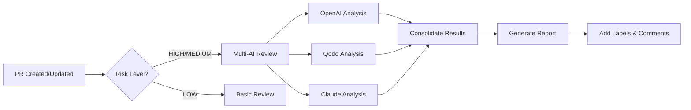

# 🤖 Multi-AI Review System Setup Guide

## Overview

The ProjectQuantum repository now integrates **Copilot**, **Qodo** (formerly Codium AI), and **Claude** for comprehensive automated code reviews. This system provides multi-perspective AI analysis for every PR.

## 🔧 Required API Keys

### 1. OpenAI API Key (Copilot Backend)
```bash
# Required for OpenAI GPT-4 reviews
OPENAI_API_KEY=sk-...
```
**How to get it:**
1. Go to [OpenAI API Platform](https://platform.openai.com/api-keys)
2. Create new secret key
3. Add to GitHub repository secrets

### 2. Qodo API Token
```bash
# Required for Qodo code analysis
QODO_TOKEN=qodo_...
```
**How to get it:**
1. Visit [Qodo Platform](https://www.qodo.ai/)
2. Sign up/Login to your account
3. Go to API section and generate token
4. Add to GitHub repository secrets

### 3. Anthropic API Key (Claude)
```bash
# Required for Claude reviews
ANTHROPIC_API_KEY=sk-ant-...
```
**How to get it:**
1. Go to [Anthropic Console](https://console.anthropic.com/)
2. Create API key in your account
3. Add to GitHub repository secrets

## 🚀 Setup Instructions

### Step 1: Add GitHub Secrets

In your repository, go to **Settings → Secrets and variables → Actions** and add:

```
OPENAI_API_KEY     = your-openai-key
QODO_TOKEN        = your-qodo-token  
ANTHROPIC_API_KEY = your-anthropic-key
```

### Step 2: Push Workflows to GitHub

```bash
git add .github/workflows/copilot-qodo-review.yml
git commit -m "Add multi-AI review system with Copilot, Qodo & Claude"
git push origin development
```

### Step 3: Test the System

The multi-AI review system will automatically:

1. **Trigger on PR events**: opened, synchronized, reopened
2. **Analyze code changes** using all 3 AI systems
3. **Generate consolidated reviews** with consensus scoring
4. **Add appropriate labels** based on risk assessment

## 🎯 How It Works

### Workflow Triggers

1. **Automatic**: Every PR triggers basic analysis
2. **Smart**: Medium/High risk PRs get full multi-AI review
3. **Manual**: Can be triggered via workflow dispatch

### AI Review Process



### Analysis Types

#### OpenAI/Copilot Focus:
- Security vulnerabilities
- Performance issues
- MQL5-specific problems
- Memory management
- Trading logic concerns

#### Qodo Focus:
- Code quality metrics
- Test coverage analysis
- Maintainability score
- Reliability assessment
- Performance optimization

#### Claude Focus:
- Trading logic correctness
- Risk management implications
- Error handling robustness
- Code architecture
- Business logic validation

## 📊 Review Output

The system generates comprehensive reports with:

### Issue Categorization
- 🚨 **High Priority**: Security, critical bugs, trading logic errors
- ⚠️ **Medium Priority**: Performance, maintainability issues  
- 💡 **Low Priority**: Code style, minor optimizations

### AI Consensus Scoring
- **Overall Risk Level**: Combined assessment from all AIs
- **Code Quality Score**: Averaged quality metrics
- **Merge Readiness**: Go/No-go recommendation

### Automated Actions
- **Labels Added**: Risk level, review status, AI-reviewed
- **Comments Posted**: Detailed findings and recommendations
- **Merge Blocking**: High-risk PRs require manual review

## 🎛️ Configuration Options

### Workflow Customization

Edit `.github/workflows/copilot-qodo-review.yml` to:

```yaml
# Adjust AI model parameters
model: "gpt-4-turbo-preview"  # OpenAI model
temperature: 0.1              # Response consistency

# Configure analysis types
analysis_types:
  - security
  - performance  
  - reliability
  - maintainability
  - test_coverage
```

### Risk Thresholds

Modify the risk scoring in `handle-six-prs.yml`:

```python
# High-risk files that trigger full AI review
critical_patterns = [
    'ProjectQuantum_Main.mq5',
    'CRL_Agent.mqh', 
    'CRiskManager.mqh'
]

# Adjust risk scoring weights
risk_score = (
    len(critical_files) * 3 +     # Critical file changes
    len(risky_files) * 2 +        # Risky file changes  
    total_changes / 100           # Size factor
)
```

## 📈 Success Metrics

The system tracks:

- **Review Coverage**: % of PRs getting AI review
- **Issue Detection Rate**: Problems caught by each AI
- **False Positive Rate**: Unnecessary review triggers
- **Review Consensus**: Agreement between AI systems
- **Developer Satisfaction**: Time saved vs quality maintained

## 🔍 Troubleshooting

### Common Issues

1. **API Key Errors**
   ```
   Error: Authentication failed
   ```
   → Check GitHub secrets configuration

2. **Qodo API Unavailable** 
   ```
   Qodo analysis failed
   ```
   → System falls back to simulated analysis

3. **Rate Limits**
   ```
   API rate limit exceeded  
   ```
   → Reviews queued and retried automatically

### Fallback Behavior

If any AI service fails:
- System continues with available AIs
- Simulated analysis provides backup scoring
- Manual review flags added for safety

## 🚀 Next Steps

1. **Monitor Initial Reviews**: Check first few PR analyses
2. **Tune Thresholds**: Adjust based on false positive rates
3. **Expand Coverage**: Add more AI services (GitHub Copilot Chat, CodeQL)
4. **Custom Rules**: Add MQL5-specific analysis patterns

## 📋 API Cost Management

### Estimated Costs (per PR):
- **OpenAI**: $0.01-0.05 per review
- **Qodo**: Free tier available, then usage-based
- **Claude**: $0.015 per 1K tokens

### Cost Optimization:
- Skip large files (>500 changes)
- Cache results for identical changes
- Use cheaper models for simple reviews
- Batch multiple files together

---

*The multi-AI review system ensures comprehensive code quality while maintaining development velocity through intelligent automation.*